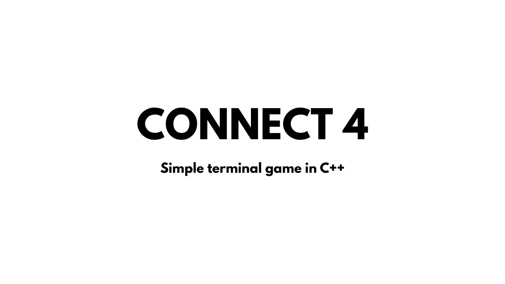

# 🟡🔴 Connect 4 - Terminal Game

A simple implementation of the classic **Connect 4** game in **C++** for the terminal.  

## ▶️ Demo
[](https://youtu.be/HOrA5nEC7xU)

## ⚙️ Build & Run

### Clone the repository  
```bash
git clone https://github.com/your-username/connect-four.git
cd connect-four
```
### Build
```bash
# Create and enter build directory
mkdir build && cd build

# Generate build files with CMake
cmake ..

# Compile the project
make
```
### Run
```bash
./bin/connect4
```

## ⚖️ License
This project is licensed under the [MIT License](LICENSE).

